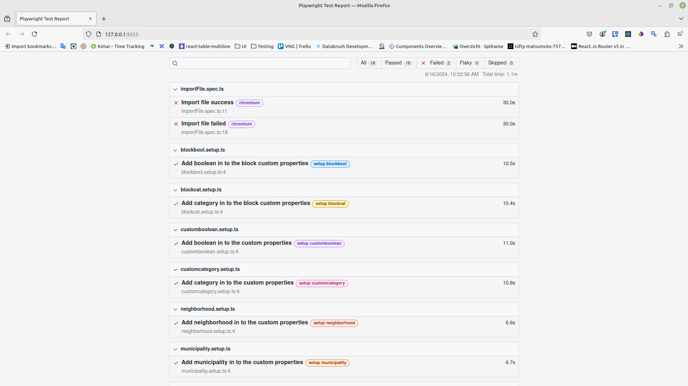

# Project Title

## Steps to Run Tests

0. **Setup Database:** Delete the database and create with fresh data. Run the following commands from the project root directory.

    ```shell
    dropdb diwi
    createuser diwi
    psql -c "ALTER USER \"diwi\" WITH PASSWORD 'diwi'"
    createdb diwi -O diwi
    ```

1. **Deploy Backend:** Run the `deploy.backend.dev.sh` script from the project root directory.

    ```bash
    ./deploy.backend.dev.sh
    ```

2. **Start Frontend:** Navigate to the `frontend` directory, install dependencies and start the server.

    ```shell
    cd frontend
    yarn && yarn start
    ```

3. **Open Browser:** <http://localhost:3000> and login with admin account.

    ```
    username: admin
    password: admin
    ```

4. **Open valentina studio:** diwi>diwi>user_state and update Ad Min role with userPlus.

    **Note**: _If you not logged in Ad Min user will not be listed in database._

5. **Run End-to-End Tests with Ui:** Navigate to the `end-to-end-tests` directory and run the tests. If you want to see test steps in ui you can run this. Otherwise step 5 will be enough to test whole process.

    ```shell
    cd ../end-to-end-tests
    yarn playwright install --with-deps
    yarn && yarn run test-ui
    ```

6. **See Results:** After automation test finished it will open in browser test results.

    ```
    http://127.0.0.1:9323/
    ```


